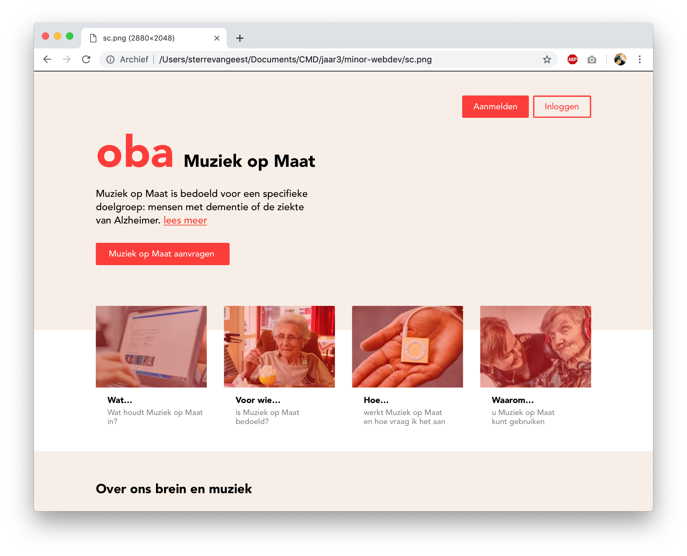

🎓 **Project 1 @cmda-minor-web 18-19**

# oba Muziek op Maat

This application helps a **_family care giver??_** who takes care of someone that suffers from dementia.

> _"As a way of helping care for and support people with dementia, music has been shown to often have a dramatic effect. Music can soothe, stimulate and bring to mind long-forgotten memories."_ [Age Uk](https://www.ageuk.org.uk/information-advice/health-wellbeing/conditions-illnesses/dementia/dementia-and-music/)

The family care giver can choose 30 songs that bring back these memories. A list with these songs will be sent to the OBA. An employees will put these songs on an iPod. Members of the OBA can borrow this iPod for 3 months.

Technieken geleerd bij [CSS to the Rescue](https://github.com/cmda-minor-web/css-to-the-rescue-1819) en [Web App from Scratch](https://github.com/cmda-minor-web/web-app-from-scratch-1819) worden toegepast bij het bouwen van de de prototypes.
